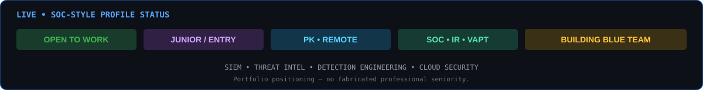

<p align="center">
  
</p>

<p align="center">
  
  
  
  
</p>

<p align="center">
  <a href="mailto:mahrukhsajj@gmail.com"></a>
  <a href="https://www.linkedin.com/in/Ms.mahrukh"></a>
  <a href="https://github.com/mahrukh89"></a>
</p>

<p align="center">
  
</p>

---

## 🟢 LIVE SOC-STYLE STATUS

<p align="center">
  
</p>

<p align="center">
  <b>Think like an attacker. Build like a defender.</b>
</p>

---

## 🐍 LIVE GITHUB CONTRIBUTION FEED

<p align="center">
  <picture>
    <source media="(prefers-color-scheme: dark)" srcset="https://raw.githubusercontent.com/mahrukh89/mahrukh89/output/github-snake-dark.svg">
    <source media="(prefers-color-scheme: light)" srcset="https://raw.githubusercontent.com/mahrukh89/mahrukh89/output/github-snake.svg">
    
  </picture>
</p>

<p align="center">
  <sub>Automated with GitHub Actions · regenerated every 6 hours</sub>
</p>

---

## 🛡️ About Me

I'm a **BS Cyber Security student (graduating 2027)** at UMT Lahore, building hands-on experience across **SOC operations, incident investigation, vulnerability assessment, and cloud security**.

I'm currently targeting **entry-level SOC Analyst, Cybersecurity Analyst, and Junior VAPT** opportunities.

---

## 🎯 What I Do

| Area | Hands-on Focus |
|---|---|
| **SOC & SIEM** | Alert triage, log analysis, Microsoft Sentinel, Wazuh, Elastic Stack |
| **Incident Response** | KQL investigations, timelines, root-cause analysis, remediation |
| **Threat Intelligence** | Phishing/email analysis, IOC correlation, OSINT, OpenCTI |
| **Detection Engineering** | Sigma concepts, detection logic, MITRE ATT&CK mapping |
| **Web VAPT** | OWASP Juice Shop, vulnerability validation, CVE-level documentation |
| **Cloud Security** | AWS S3, IAM, CloudTrail, least-privilege controls |
| **Security Engineering** | Linux-based WebShield firewall and traffic filtering |

---

## 🧰 Security Stack

<p align="center">
  
  
  
  
  
  
  
  
  
</p>

<p align="center">
  
  
  
  
  
  
  
</p>

---

## 🚨 SOC COMMAND CENTER

<p align="center">
  
  
  
</p>

<p align="center">
  
  
</p>

<p align="center">
  
</p>

---

## 🧪 FEATURED SECURITY LABS

| Repository | What It Demonstrates |
|---|---|
| 🔥 **WebShield_Firewall** | Linux-based web application firewall for traffic monitoring, filtering, logging, and security controls |
| 🐛 **Security-Analysis-of-OWASP-Juice-Shop** | Security analysis, threat modeling, vulnerability validation, and remediation |
| 🐚 **reverse-shell-security-lab** | Controlled Android Termux + Ubuntu reverse-shell communication analysis and defensive review |
| 🎭 **social-engineering-security-lab** | Controlled social-engineering security lab with impact analysis and mitigation |
| 🖥️ **cli-task-manager-cpp** | C++ command-line application demonstrating programming and file-handling fundamentals |

---

## 🔬 CURRENT SOC BUILD

### 🔐 Enterprise SOC Detection & Incident Response Lab

A dedicated Blue Team home lab designed around a realistic enterprise incident lifecycle.

```text
WINDOWS ENDPOINT
      │
   Sysmon
      │
      ▼
    WAZUH
      │
      ▼
 ALERT TRIAGE
      │
      ├── IOC ANALYSIS
      ├── MITRE ATT&CK
      ├── TIMELINE
      └── ROOT CAUSE
              │
              ▼
       CONTAINMENT / IR
              │
              ▼
        INCIDENT REPORT
```

**Planned evidence:** detection rules · alerts · screenshots · investigation timeline · ATT&CK mapping · incident report · remediation.

---

## 🧬 Detection Engineering

The goal is to publish **actual detection logic and investigation evidence**, not just a list of tools.

Planned detection coverage includes:

| Technique | Detection Focus |
|---|---|
| **T1059.001** | Suspicious PowerShell execution |
| **T1110** | Brute-force authentication activity |
| **T1078** | Valid-account abuse |
| **T1053** | Suspicious scheduled task activity |
| **T1071** | Suspicious application-layer communication |

All detections will be validated inside an isolated lab before publication.

---

## 🧭 Blue Team Workflow

```text
TELEMETRY
   ↓
LOG COLLECTION
   ↓
ALERT TRIAGE
   ↓
IOC / CONTEXT ANALYSIS
   ↓
INVESTIGATION
   ↓
MITRE ATT&CK MAPPING
   ↓
CONTAINMENT
   ↓
ROOT-CAUSE ANALYSIS
   ↓
INCIDENT REPORT
   ↓
DETECTION IMPROVEMENT
```

---

## 📜 Certifications

- Cisco — Ethical Hacker
- TryHackMe — SOC Level 1 Path
- Cisco — Cyber Threat Management
- Cisco — Cybersecurity Essentials
- Cisco — Introduction to Cybersecurity
- OPSWAT — ICIP

---

## 💼 Experience

**Freelance Project Coordinator** · *Feb 2024 – Present*  
Coordinate remote technical projects across distributed teams, managing deadlines, risks, and project communication.

**Project Manager Intern — Human Alliance Organization** · *Jun 2024 – Jul 2024*  
Managed an organizational seminar end-to-end, including logistics, scheduling, and stakeholder communication.

---

## 🎓 Education

**University of Management and Technology (UMT), Lahore**  
BS Cyber Security · *2023 – 2027 Expected*

**Aspire College, Jhang**  
ICS · *2021 – 2023*

---

## 📡 Portfolio Roadmap

```text
[✓] Security-focused GitHub foundation
[✓] Publish hands-on security labs
[✓] Document SOC / VAPT / cloud work
[✓] Automated contribution visualization
[→] Enterprise SOC Detection & IR Lab
[→] Sigma detections + ATT&CK mappings
[→] Threat-hunting case studies
[→] Incident-response reports
[→] Detection engineering portfolio
[→] Entry-level SOC / Cybersecurity opportunities
```

---

## 🌍 Quick Facts

| | |
|---|---|
| **Role** | Junior Cybersecurity Analyst / SOC Analyst |
| **Focus** | SOC Operations · Incident Investigation · VAPT · Cloud Security |
| **Open to** | SOC Analyst · Cybersecurity Analyst · Junior VAPT |
| **Location** | Lahore, Punjab, Pakistan |
| **Languages** | English · Urdu · Chinese (Beginner) |

---

## 📬 Connect

<p align="center">
  <a href="mailto:mahrukhsajj@gmail.com"></a>
  <a href="https://www.linkedin.com/in/Ms.mahrukh"></a>
  <a href="https://github.com/mahrukh89"></a>
</p>

<p align="center">
  <i>Building evidence, not just claiming skills.</i>
</p>

<p align="center">
  
</p>
