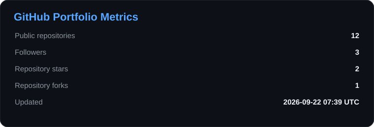
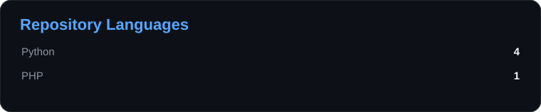
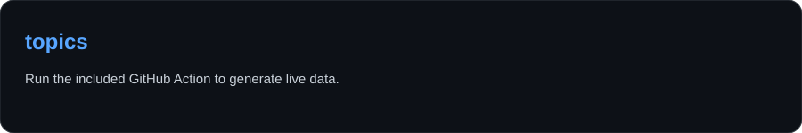
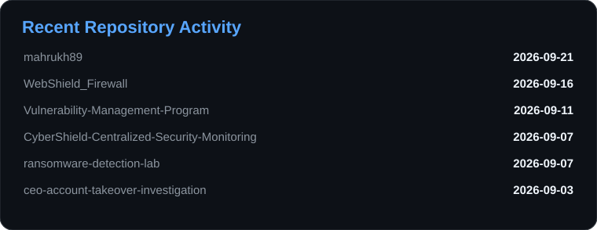
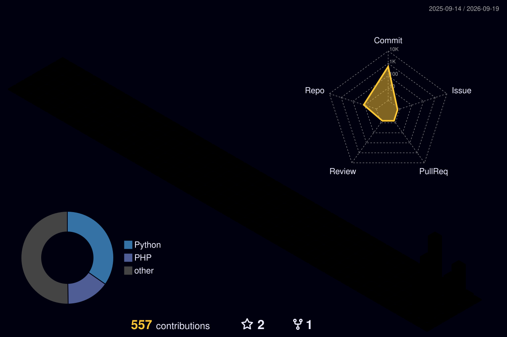
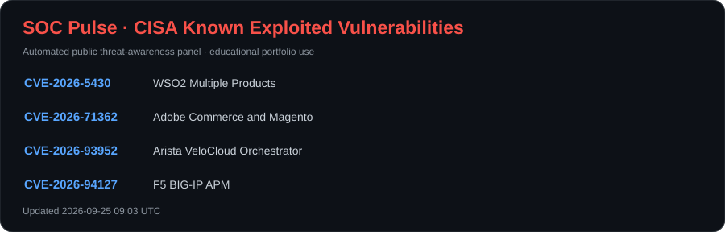
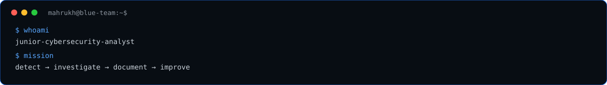
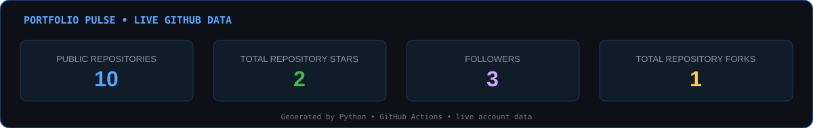

<p align="center">
  
</p>

<p align="center">
  
  
  
  
</p>

<p align="center">
  <a href="mailto:mahrukhsajj@gmail.com"></a>
  <a href="https://www.linkedin.com/in/Ms.mahrukh"></a>
  <a href="https://github.com/mahrukh89"></a>
</p>

<p align="center">
  
</p>

---

## 🟢 LIVE TECHNICAL PM PROFILE STATUS

<p align="center">
  
  
  
  
  
</p>

<p align="center">
  
  
  
  
</p>

<p align="center">
  <b>Bridging technical teams, security work, stakeholders, and delivery.</b>
</p>

---

## 🐍 LIVE GITHUB CONTRIBUTION FEED

<p align="center">
  
</p>

<p align="center">
  <sub>Automatically regenerated every 6 hours through GitHub Actions.</sub>
</p>

---

---

## 📊 LIVE ENGINEERING METRICS

<p align="center"></p>
<p align="center"> </p>
<p align="center"></p>

> Generated from public GitHub data by Python and refreshed with GitHub Actions.

---

## 🧊 3D CONTRIBUTION SKYLINE

<p align="center"></p>

---

## 🚨 SOC PULSE

<p align="center"></p>

> Automated from the public CISA Known Exploited Vulnerabilities catalog for portfolio threat awareness.


## 🧭 About Me

I'm a **BS Cyber Security student (graduating 2027)** with hands-on experience in both **technical project coordination** and **cybersecurity operations**.

My strongest career direction is **Technical Project Management / Project Coordination for cybersecurity, IT, cloud, and security operations teams**. I enjoy converting technical objectives into structured plans, work packages, schedules, ownership matrices, risk registers, stakeholder updates, and measurable delivery milestones.

My cybersecurity background helps me communicate with technical teams instead of managing projects only at a surface level. I understand the context behind **SOC operations, SIEM, incident response, vulnerability assessment, cloud security, IAM, threat intelligence, and security engineering**, and I use that understanding to coordinate technical work more effectively.

Currently targeting opportunities such as **Technical Project Coordinator, Junior Technical Project Manager, Cybersecurity Project Coordinator, PMO Coordinator, Security Program/Project Assistant, and IT Project Coordinator**.

---

## 🎯 Technical PM + Cybersecurity Focus

| Area | What I Can Demonstrate |
|---|---|
| **Project Planning** | Project charters, scope definition, WBS, milestones, timelines, Gantt charts, deliverables and acceptance criteria |
| **Project Coordination** | Task ownership, follow-ups, dependency tracking, meeting actions, status reporting and delivery coordination |
| **Risk & Governance** | RAID logs, risk registers, issue tracking, change logs, escalation paths and governance documentation |
| **Stakeholder Management** | Stakeholder registers, communication plans, RACI matrices, meeting summaries and expectation management |
| **Agile / Hybrid Delivery** | Backlogs, sprint planning concepts, Kanban-style tracking, stand-ups, retrospectives and hybrid project workflows |
| **Technical Documentation** | Requirements, implementation plans, SOPs, handover documents, incident reports and executive-friendly summaries |
| **Cybersecurity Operations** | SOC monitoring, SIEM, alert triage, incident investigation, threat intelligence, VAPT and cloud security |
| **Security Project Context** | Endpoint deployment, logging/SIEM rollout, detection engineering, IAM, cloud controls and security monitoring projects |

---|---|
| **SOC & SIEM** | Alert triage and log analysis in Microsoft Sentinel, Wazuh, and Elastic Stack; Sigma-based detection concepts |
| **Incident Response** | Simulated incident investigation in Sentinel using **KQL** — timeline building, root-cause analysis, and remediation write-ups |
| **Threat Intelligence** | Phishing/email investigation via header, URL, and OSINT analysis; IOC correlation in **OpenCTI** |
| **Web App VAPT** | Structured penetration testing against OWASP Juice Shop and university lab targets; CVE-level vulnerability documentation |
| **Cloud Security** | AWS **S3 + IAM + CloudTrail** — least-privilege access control and audit logging |
| **Security Engineering** | Designed and built a custom web application firewall for traffic filtering |

---

<p align="center">
  
</p>

> **Think like an attacker. Build like a defender.**

<p align="center">
  
</p>

---

## 🐍 CONTRIBUTION ACTIVITY

<p align="center">
  <picture>
    <source media="(prefers-color-scheme: dark)" srcset="https://raw.githubusercontent.com/mahrukh89/mahrukh89/output/github-snake-dark.svg">
    <source media="(prefers-color-scheme: light)" srcset="https://raw.githubusercontent.com/mahrukh89/mahrukh89/output/github-snake.svg">
    
  </picture>
</p>

---

## 🧭 Currently Focused

- 📌 **Managing** — an enterprise-style security monitoring implementation as a Technical PM portfolio project.
- 🗂️ **Building PM artifacts** — charter, requirements, scope, WBS, Gantt, RACI, stakeholder register, RAID log, communication plan and handover documentation.
- 🛡️ **Applying cybersecurity context** — Wazuh, Sysmon, SIEM, endpoint telemetry, detection rules, MITRE ATT&CK and incident-response workflows.
- 📊 **Tracking delivery** — milestones, dependencies, project risks, status reporting, ownership and closure criteria.
- 🤝 **Strengthening coordination skills** — stakeholder communication, technical-team alignment, meeting actions and escalation.
- ⚙️ **Learning** — Agile/Scrum, PMO practices, Jira-style workflows, project governance and technical delivery management.

---

## 💬 Ask Me About

`Technical Project Management` · `Project Coordination` · `WBS` · `Gantt Charts` · `RACI` · `RAID Logs` · `Stakeholder Management` · `Agile / Scrum` · `Project Documentation` · `Cybersecurity Projects` · `SOC` · `SIEM` · `Incident Response` · `GRC` · `Wazuh`

---

## 📁 Technical Project Management Portfolio

### 🛡️ Enterprise Security Monitoring Implementation
**Role demonstrated:** Technical Project Manager / Project Coordinator

`INITIATION → PLANNING → EXECUTION → MONITORING & CONTROL → HANDOVER → CLOSURE`

**Portfolio deliverables**

- Project charter and business objective
- Requirements and scope baseline
- Work Breakdown Structure (WBS)
- Project schedule / Gantt chart
- RACI responsibility matrix
- Stakeholder register
- RAID / risk register
- Communication and reporting plan
- Technical implementation tracking
- Change / issue management
- Project status reporting
- UAT / acceptance and handover documentation
- Lessons learned and project closure report

**Technical workstreams coordinated**

`CORE INFRASTRUCTURE` → `ENDPOINT AGENT DEPLOYMENT` → `SIEM / LOG INGESTION` → `SOC RULES & GOVERNANCE` → `VALIDATION` → `HANDOVER`

> This project is designed to show that I can understand a cybersecurity implementation technically **and** manage its delivery as a structured project.

---

## 🧩 Project Management Skills

| Planning & Delivery | Governance & Communication | Technical Coordination |
|---|---|---|
| Scope & requirements | Stakeholder management | Cybersecurity workstreams |
| WBS & milestones | RACI / ownership | Engineering-team coordination |
| Scheduling & Gantt | RAID / risk management | Dependency tracking |
| Task tracking | Status reporting | Implementation follow-up |
| Agile / hybrid workflows | Meeting actions | Technical documentation |
| Resource awareness | Escalation & change control | Handover / acceptance |

---

## 🧰 PM & Collaboration Tools

<p>
  
  
  
  
  
  
  
  
</p>

**PM methods & artifacts:** `Agile` · `Scrum` · `Kanban` · `Hybrid Delivery` · `WBS` · `Gantt` · `RACI` · `RAID` · `Risk Register` · `Stakeholder Register` · `Communication Plan` · `Status Report` · `Change Log` · `Lessons Learned`

---

## 🧬 Detection Engineering — Sample Portfolio

The goal is to show **detection logic + investigation reasoning**, not only tool names.

| Technique | Use Case | Portfolio Status |
|---|---|---|
| **T1059.001** | Suspicious / encoded PowerShell | 🟡 Building |
| **T1110** | Brute-force authentication activity | 🟡 Building |
| **T1078** | Suspicious valid-account activity | 🟡 Building |
| **T1053.005** | Suspicious scheduled-task creation | 🟡 Building |
| **T1046** | Network/service discovery | 🟡 Building |
| **T1071.004** | Suspicious DNS communication | 🟡 Planned |

> Every rule will be validated inside an isolated lab before being presented as portfolio evidence.

---

## 🧯 Incident Response Case Studies

### Case 01 — Simulated CEO Account Takeover
**Microsoft Sentinel · KQL**

`SIGN-IN ANOMALY → TRIAGE → CORRELATION → IOC ANALYSIS → RCA → CONTAINMENT → REMEDIATION → REPORT`

### Case 02 — Phishing Email Investigation
**OpenCTI · OSINT**

`EMAIL → HEADER ANALYSIS → URL/DOMAIN ANALYSIS → IOC EXTRACTION → INTEL CORRELATION → RISK ASSESSMENT → REPORT`

---

## 🤖 Python Security Automation

Python is used as a **security automation layer**, not simply as a badge.

```text
LOG / IOC INPUT
      ↓
PYTHON PARSER
      ↓
NORMALIZATION
      ↓
IOC EXTRACTION
      ↓
ENRICHMENT
      ↓
RULE / RISK CHECK
      ↓
ANALYST OUTPUT
```

Planned automation:

- IOC extraction and normalization
- security-log parsing
- repeatable investigation helpers
- analyst report generation
- detection-rule validation
- GitHub portfolio metrics

---

## 📊 Portfolio Pulse

<p align="center">
  
</p>

<p align="center">
  <sub>Generated by Python + GitHub Actions from GitHub account data. No manually invented metrics.</sub>
</p>

---

## 🚀 Featured Technical PM & Security Projects

| Project | What It Demonstrates |
|---|---|
| 📋 **Enterprise Security Monitoring — Technical PM Portfolio** | End-to-end project lifecycle, WBS, Gantt, RACI, RAID, stakeholder coordination, security implementation tracking and handover |
| 🔥 **WebShield Firewall** | Traffic filtering, monitoring, logging and security engineering |
| 🐛 **OWASP Juice Shop Security Analysis** | Web security assessment, vulnerability validation and remediation |
| 🐚 **Reverse Shell Security Lab** | Controlled attack simulation and defensive communication analysis |
| 🎭 **Social Engineering Security Lab** | Security awareness, impact analysis and mitigation |
| ☁️ **Cloud Security Operations** | IAM, MFA, SSO, encryption, logging and brute-force response |
| 🔐 **Enterprise SOC Detection & IR Lab** | SIEM, endpoint telemetry, detections, ATT&CK mapping and IR |

---

## 🧠 Blue Team Investigation Lifecycle

```text
01  COLLECT TELEMETRY
        ↓
02  TRIAGE ALERT
        ↓
03  VALIDATE SIGNAL
        ↓
04  CORRELATE IOC / CONTEXT
        ↓
05  INVESTIGATE
        ↓
06  MAP MITRE ATT&CK
        ↓
07  CONTAIN
        ↓
08  REMEDIATE
        ↓
09  DOCUMENT RCA
        ↓
10  IMPROVE DETECTION
```

---

## 📡 Portfolio Roadmap

```text
[✓] GitHub security portfolio foundation
[✓] Publish hands-on security labs
[✓] Document SOC / VAPT / cloud work
[✓] Contribution automation
[→] Enterprise SOC Detection & IR Lab
[→] Sigma detection catalogue
[→] ATT&CK coverage matrix
[→] Threat-hunting case studies
[→] Python SOC automation
[→] Incident-response reports
[→] Detection engineering portfolio
[→] Continuous GitHub automation
```

---

## 🧰 Technical PM + Security Stack

### Project Delivery
<p>
  
  
  
  
  
  
</p>

### Cybersecurity & Technical
<p>
  
  
  
  
  
  
  
  
</p>

<p>
  
  
  
  
  
  
  
</p>

---

## 📡 TECHNICAL DELIVERY COMMAND CENTER

<p align="center">
  
  
  
</p>

<p align="center">
  
  
</p>

<p align="center">
  
</p>

<p align="center">
  
</p>

---

## 🗃️ Featured Portfolio Repositories

| Repository | What It Demonstrates |
|---|---|
| 📋 **Technical Project Management Portfolio** | Cybersecurity project initiation, planning, WBS, Gantt, RACI, RAID, stakeholder management, execution tracking and closure |
| 🔥 [**WebShield_Firewall**](https://github.com/mahrukh89/WebShield_Firewall) | Linux-based web application firewall for traffic monitoring, filtering, logging, and security controls |
| 🐛 [**Security-Analysis-of-OWASP-Juice-Shop**](https://github.com/mahrukh89/Security-Analysis-of-OWASP-Juice-Shop) | Structured security analysis, threat modeling, vulnerability validation, and remediation |
| 🐚 [**reverse-shell-security-lab**](https://github.com/mahrukh89/reverse-shell-security-lab) | Controlled Android Termux + Ubuntu reverse-shell communication analysis and defensive review |
| 🎭 [**social-engineering-security-lab**](https://github.com/mahrukh89/social-engineering-security-lab) | Controlled social-engineering security lab with impact analysis and mitigation strategies |
| 🖥️ [**cli-task-manager-cpp**](https://github.com/mahrukh89/cli-task-manager-cpp) | C++ command-line task manager demonstrating programming and file-handling fundamentals |

### 🔐 Security Projects Being Expanded

- **Enterprise SOC Detection & Incident Response Lab** — Wazuh, Sysmon, Sigma, MITRE ATT&CK, Windows/Ubuntu telemetry, alert triage, investigation, and incident reporting.
- **Simulated CEO Account Takeover Investigation** — Microsoft Sentinel, KQL, incident timeline, root-cause analysis, and remediation.
- **Phishing Email Investigation & Threat Intelligence** — OpenCTI, OSINT, IOC correlation, and analyst reporting.
- **Secure Cloud Storage** — AWS S3, IAM, CloudTrail, least-privilege access control, and audit logging.

---

## 🧭 Blue Team Workflow

```text
TELEMETRY
   ↓
LOG COLLECTION
   ↓
ALERT TRIAGE
   ↓
IOC / CONTEXT ANALYSIS
   ↓
INVESTIGATION
   ↓
MITRE ATT&CK MAPPING
   ↓
CONTAINMENT / REMEDIATION
   ↓
ROOT-CAUSE ANALYSIS
   ↓
INCIDENT REPORT
   ↓
DETECTION IMPROVEMENT
```

---

## 🧪 University & Personal Security Labs

- Web application security testing in a supervised university environment, including CVE-level vulnerability documentation and controlled password-cracking exercises.
- Controlled Android (Termux) and Ubuntu security testing, including reverse-shell communication analysis and defensive review.
- Hands-on work with SOC monitoring, cloud security, threat intelligence, vulnerability assessment, and security engineering concepts.

---

## 📜 Certifications

<p>
  
  
  
  
  
  
</p>

---

## 💼 Experience

**Freelance Project Coordinator** — Self-employed, Lahore, Pakistan · *Feb 2024 – Present*  
Coordinate remote technical and digital projects across distributed teams, track tasks and deadlines, maintain project documentation, follow up on dependencies, communicate progress, and escalate delivery risks when needed.

**Project Manager Intern** — Human Alliance Organization (HAO), Lahore, Pakistan · *Jun 2024 – Jul 2024*  
Supported end-to-end planning and delivery of an organizational seminar, including scheduling, logistics, stakeholder communication, task coordination, progress follow-up, and event execution.

---

## 🎓 Education

**University of Management and Technology (UMT), Lahore** — BS Cyber Security · *2023 – 2027 (Expected)*  
Coursework: Network Security, Database Systems, Programming (Python, C++), IT Operations

**Aspire College, Jhang** — ICS (Intermediate in Computer Science) · *2021 – 2023*

---

## 📊 Current Build Roadmap

```text
[✓] Build cybersecurity-focused GitHub foundation
[✓] Publish hands-on technical/security repositories
[✓] Add automated GitHub portfolio visualizations
[✓] Add Technical Project Management positioning
[→] Publish Enterprise Security Monitoring PM portfolio
[→] Add charter + requirements + scope + WBS
[→] Add Gantt + RACI + stakeholder + RAID artifacts
[→] Add status reporting + issue/change tracking
[→] Add project closure + handover documentation
[→] Expand Agile / Scrum / PMO project examples
[→] Target Technical PM / Project Coordinator / Cyber PM roles
```

---

## 🌍 Quick Facts

| | |
|---|---|
| **Role** | Technical Project Coordinator / Junior Technical Project Manager |
| **Focus** | Technical PM · Cybersecurity Projects · Delivery · Risk · Stakeholders |
| **Open to** | Technical Project Coordinator · Junior Technical PM · Cybersecurity PM · PMO / IT Project Coordinator |
| **Location** | Lahore, Punjab, Pakistan |
| **Languages** | English · Urdu · Chinese (Beginner) |
| **Email** | [mahrukhsajj@gmail.com](mailto:mahrukhsajj@gmail.com) |
| **LinkedIn** | [linkedin.com/in/Ms.mahrukh](https://www.linkedin.com/in/Ms.mahrukh) |

---

## 📈 GitHub Activity

<p align="center">
  
</p>

<p align="center">
  
</p>

---

## 📬 Let's Connect

<p align="center">
  <a href="mailto:mahrukhsajj@gmail.com"></a>
  <a href="https://www.linkedin.com/in/Ms.mahrukh"></a>
</p>

<p align="center">
  <i>Managing delivery with technical context — building evidence, not just claiming skills.</i>
</p>

<p align="center">
  
</p>
